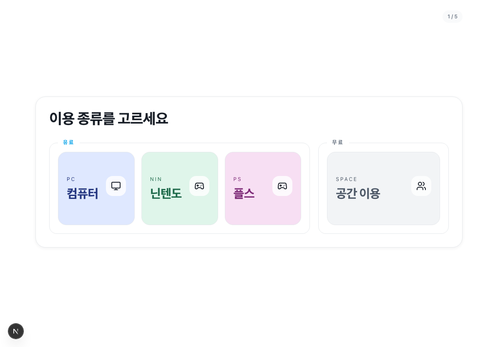
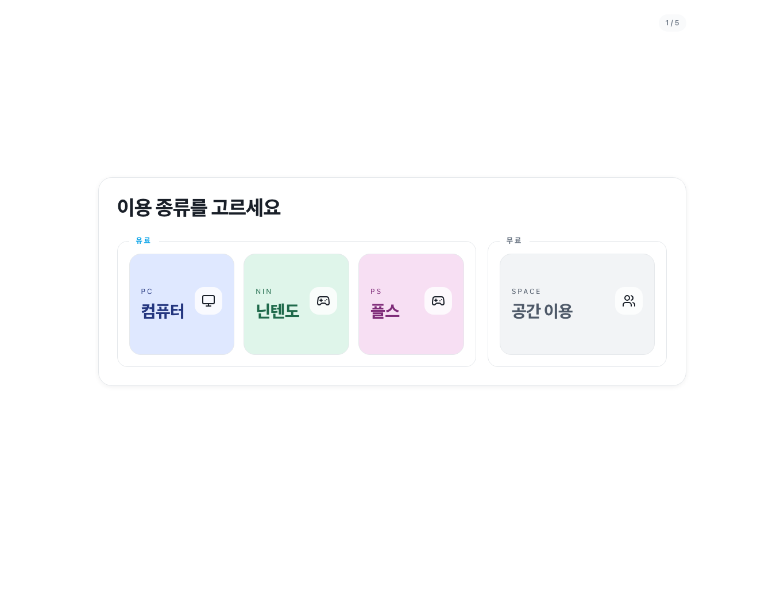

# autoPAN - 나놀다판 접수 키오스크

노원청소년센터 3층 **나놀다판**에서 사용하는 청소년 이용 접수 키오스크입니다.
청소년 또는 보호자가 태블릿에서 직접 이용 종류를 선택하고, 기존 회원 조회 또는 첫 방문 정보를 입력하면 접수 내용이 Google Sheets 운영 문서로 기록됩니다.

현재 운영 기준은 **Vercel 배포 + Google Sheets 연동 + 태블릿 키오스크 잠금 흐름**입니다. Docker, Windows 서버, Ubuntu 자체 서버 운영 방식은 더 이상 현재 기준이 아닙니다.

## 실제 화면

### 태블릿 키오스크 화면



### 데스크톱 캡처 화면



## 프로젝트 목적

나놀다판은 PC, 닌텐도, 플레이스테이션, 공간 이용을 운영하는 청소년 활동 공간입니다. 기존에는 현장 접수와 Google Sheets 기록이 사람 손에 많이 의존했기 때문에 다음 문제가 있었습니다.

- 접수자가 많을 때 직원이 이름, 연락처, 이용 종류를 반복 입력해야 함
- 재방문 청소년 확인이 느림
- 유료 이용과 공간 이용 기록이 섞이기 쉬움
- 태블릿 접수 화면이 아닌 다른 화면으로 이동할 위험이 있음

autoPAN은 이 흐름을 **태블릿 한 화면 접수 -> Google Sheets 기록 -> 직원 확인** 구조로 단순화합니다.

## 현재 운영 범위

- 운영 장소: 노원청소년센터 3층 나놀다판
- 주 사용자: 청소년, 보호자, 청소년사업부 담당자
- 운영 화면: `/kiosk`
- 배포 방식: Vercel
- 데이터 연동: Google Sheets
- 회원 조회: Google Sheets의 `사용자DB` 탭을 읽어서 검색
- 접수 기록: 이용 종류별 Google Sheets 탭에 저장
- 접근 정책: 배포 환경에서는 `/kiosk` 중심으로 잠금 처리

## 사용 흐름

1. 태블릿에서 키오스크 화면을 연다.
2. 청소년 또는 보호자가 이용 종류를 선택한다.
   - 컴퓨터
   - 닌텐도
   - 플스
   - 공간 이용
3. 재방문이면 이름 또는 보호자 연락처로 기존 회원을 찾는다.
4. 첫 방문이면 이름, 학교, 생년월일, 성별, 보호자 연락처를 입력한다.
5. 유료 이용은 시간권을 선택한다.
6. 접수 완료 후 Google Sheets에 기록된다.
7. 30초 이상 입력이 없으면 첫 화면으로 돌아간다.

## Google Sheets 구조

`.env.example` 기준으로 아래 연동값을 사용합니다.

- `GOOGLE_SHEETS_SPREADSHEET_ID`: 나놀다판 운영 스프레드시트 ID
- `GOOGLE_SHEETS_CLIENT_EMAIL`: Google Cloud 서비스 계정 이메일
- `GOOGLE_SHEETS_PRIVATE_KEY`: 서비스 계정 비공개 키
- `GOOGLE_SHEETS_MEMBER_RANGE`: 기존 회원 조회 범위, 기본값은 `'사용자DB'!A:Z`

기존 회원 조회용 `사용자DB` 첫 행에는 최소한 아래 헤더가 필요합니다.

- `이름`
- `보호자연락처`

선택 헤더:

- `학교명`
- `생년월일`
- `성별`
- `출생연도`

접수 기록용 탭 이름은 기본적으로 아래 값을 사용합니다.

- `컴퓨터`
- `닌텐도`
- `플스`
- `무료콘텐츠`

운영 문서의 탭 이름이 다르면 `.env`에서 아래 값으로 덮어씁니다.

```bash
GOOGLE_SHEETS_PC_TAB_NAME=컴퓨터
GOOGLE_SHEETS_NINTENDO_TAB_NAME=닌텐도
GOOGLE_SHEETS_PLAYSTATION_TAB_NAME=플스
GOOGLE_SHEETS_FREE_TAB_NAME=무료콘텐츠
```

## 운영자가 알아야 할 것

운영자는 코드를 직접 만질 필요가 없습니다. 일상 운영에서는 아래만 확인하면 됩니다.

- 태블릿에서 키오스크 화면이 열리는지
- 접수 테스트 1건이 Google Sheets에 들어오는지
- `사용자DB` 탭의 제목 행을 지우거나 바꾸지 않았는지
- 서비스 계정 이메일이 스프레드시트 편집자로 공유되어 있는지
- 오류가 나면 화면 캡처, 접수 시간, 입력한 이름을 개발자에게 전달

## 개발 실행

```bash
npm install
npm run dev
```

로컬 확인 주소:

```text
http://localhost:3000/kiosk
```

검증 명령:

```bash
npm run lint
npm run test
npm run build
```

## 배포

현재 기준 배포 대상은 Vercel입니다.

```bash
npx vercel deploy --prod --yes
```

Vercel 프로젝트에는 Google Sheets 환경변수가 등록되어 있어야 합니다. 배포 후에는 아래를 확인합니다.

- `/kiosk`가 열리는지
- 다른 경로가 `/kiosk`로 이동하는지
- 기존 회원 검색이 되는지
- 테스트 접수 1건이 Google Sheets에 기록되는지

## 프로젝트 구조

```text
src/app/kiosk/                  키오스크 페이지
src/components/kiosk-client.tsx 태블릿 접수 UI
src/app/api/sheet-members/      기존 회원 Google Sheets 조회 API
src/lib/server/google-sheets.ts Google Sheets 읽기/쓰기 연동
src/proxy.ts                    배포 화면을 /kiosk 중심으로 잠그는 라우팅
docs/assets/                    README용 실제 화면 캡처
docs/product-spec.md            제품 목적과 운영 흐름
docs/autopan-basic-design.html  초기 화면/설계 참고 자료
```

## 현재 제외한 것

현재 운영 기준에서 아래 항목은 사용하지 않습니다.

- Docker 로컬 운영
- Windows 노트북 서버 운영
- Ubuntu 자체 서버 운영
- systemd, Caddy, PostgreSQL 백업 스크립트
- 키오스크 내 카드 결제 승인
- 외부 모바일 예약

## 후임자 인수인계 메모

이 프로젝트를 이어받는 사람은 먼저 `/kiosk`와 Google Sheets 연동을 확인해야 합니다. 나놀다판 현장 운영의 핵심은 복잡한 관리자 시스템이 아니라 **청소년이 태블릿에서 접수하고, 직원은 Google Sheets 기록을 보고 운영을 이어가는 것**입니다.

수정할 때는 다음을 우선합니다.

1. 태블릿에서 큰 버튼이 잘 눌리는가
2. 첫 방문과 재방문 흐름이 끊기지 않는가
3. Google Sheets 제목 행과 수식 열을 망가뜨리지 않는가
4. `/kiosk` 잠금 정책이 유지되는가
5. 개발자 설명보다 현장 담당자가 이해할 수 있는 화면인가
